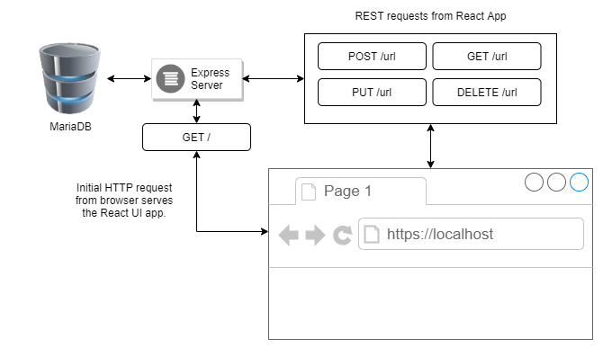

#### Note: This is a docker oriented boilerplate. [docker](https://www.docker.com/) and [docker-compose](https://docs.docker.com/compose/) is required to utilize some package scripts. 

#### High-level architecture diagram

### To get started:
- Clone this repository
- Run `npm run init`
- Run `npm run start`
- Run (in the `client/` directory) `npm run start`
- A browser will be opened for you to http://localhost:3000 (Note: you can also navigate to http://localhost:80 as the express server is serving the production build at that address.  However, while developing, use `:3000` to utilize hot-reloading.)

#### Database management:
This project uses [db-migrate](https://www.npmjs.com/package/db-migrate) and have the following relevant folder locations:
- Database config: `database/config.json`
- Migrations folder: `migrations/`
- The boilerplate uses [sequelize](https://www.npmjs.com/package/sequelize) to interface with the mariadb database.  You can find model definitions in the `database/models/` folder. A default `User` model has been created for user management.
- Package scripts: 
    * `npm run db:init` - Runs the database schema/data migrations.
    * `npm run db:reset` - Resets the database, then runs `db:init`.
    * `npm run db:create-migration -- <migration_name>` - Creates a migration with provided `migration_name`.
    * `npm run db:start` - Starts the mariadb docker container, creating it if it doesn't exist.
    * `npm run db:stop` - Stops the mariadb docker container.
    * `npm run db:info` - Displays information for the mariadb docker container.

#### Other package scripts:
- `npm run build` - Builds the project front-end.
- `npm run build:docker` - Creates the docker image for use with `docker-compose`.
- `npm run build:full` - Runs `build` and `build:docker`.
- `npm run start:docker` - Runs `build` and starts the application using `docker-compose`. 